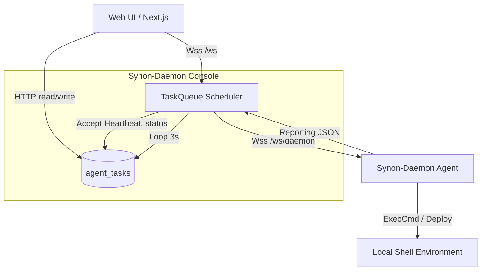

# Phase 2: Server-Client 读写隔离与调度演进

## 背景

在第一阶段（Phase 1），我们确立了 `synon-daemon` 支持 `agent` 与 `console` 两种启动模式。并在保留 `synon-daemon` 足够轻巧的基础上引入了 Axios、Tokio 实现了并行的协程支持。
本阶段将重点转移到**业务边界分离**上。

历史包袱：
老版本 Node.js `server.ts` 及后续前端直接操作 `nodes.db` 的逻辑异常复杂。数据读写、长连接通信全部混在一起。

## 目标

- 明确 `agent` 仅作为瘦节点，不直接访问数据库；
- 由 `console` 接管 `nodes.db` 唯一写权限，同时维护一套轻量级的内部通信协议供 `agent` 节点上报状态；
- `console` 提供一套任务队列引擎 `TaskQueue`，轮询拉取指令并下发执行。

## 架构演进

## 关键流程实现细节

### 1. 节点长连接维持
- Console 内部定义了 `session::SessionState`，通过 `mpsc::UnboundedSender` 实现并发线程安全的向下发信能力。
- 在 `mod.rs` 拦截 `/ws/daemon` 中获取的 `Query(Query<DaemonWsQuery>)` 提取 `nodeId` 和 `token`（基于 Axum `Query` 提取器）。
  
### 2. 心跳与指标入库
- Agent 发送包含 `sysInfo` 和 `gnbStatus` 的全量大 JSON。
- Console 端通过 `heartbeat::ingest` 在后端线程中将更新落地到 `nodes`（用于显示在线状态）和 `metrics`（用于绘制波浪图）。
- 依赖于 SQLite WAL 模型并发防冲突读写，不再担忧由于频繁更新 metrics 阻碍其他线程检索数据。

### 3. 后台轮询分发引擎
- 代替老式 Node.js 的 setInterval 定时发信功能，Rust Console 启用了 `task_queue::run_scheduler`。
- 通过防背压的 `tokio_interval.tick()` 每隔 3 秒去数据库拉取 `queued` 状态的 Tasks（限制最多 50 个避免拥堵）。
- 发现连接池中在线的 `agent` 即行下发，触发 `dispatched`。

### 4. 日志回溯
- Cmd / 操作产生的结果经 Agent 吐出 `cmd_result` 的事件经相同 WS 上传到 `console`，通过并发更新 `agent_tasks` 回传 stdout / stderr 并结算为 `success` 与 `failed`。
